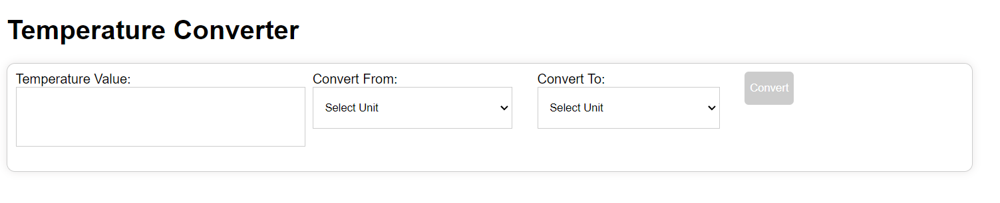

Temperature Converter

A simple and intuitive temperature conversion application.

Web link - https://abh7n.github.io/temperature-converter/

Features

- Convert temperature between Celsius, Fahrenheit, and Kelvin
- User-friendly interface
- Accurate calculations
- Supports decimal values

Installation

1. Clone the repository: git clone (link unavailable)
2. Navigate to the project directory: cd temperature-converter
3. Install dependencies: npm install (or yarn install)
4. Start the application: npm start (or yarn start)

Usage

1. Open the application in your web browser: http://localhost:3000
2. Select the input temperature unit (Celsius, Fahrenheit, or Kelvin)
3. Enter the temperature value
4. Select the output temperature unit
5. Click "Convert" to display the converted temperature

Technologies Used

- Frontend: HTML, CSS, JavaScript
- Backend: Node.js, Express.js

Contributing

Contributions are welcome! Please fork the repository, make changes, and submit a pull request.

License

This project is licensed under the MIT License.

Authors

- [Your Name](link to your GitHub profile)

Acknowledgments

- [Inspiration or resources used]

Version History

- v1.0.0 - Initial release

Screenshots

!screenshot.png

API Documentation

(link unavailable)

Support

For issues or feature requests, please open an issue on GitHub.

Commit Message Guidelines

- Use present tense (e.g., "Add feature")
- Keep messages concise and descriptive
